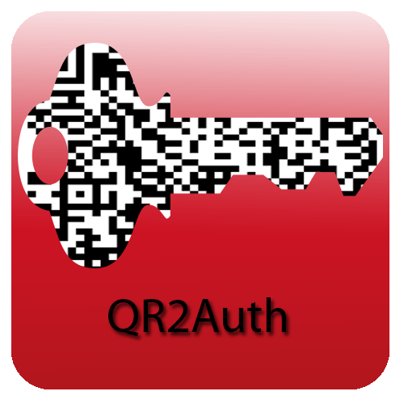

=======================================================================
QR2Auth - User Friendly Challenge Response Authentication with QR Codes
=======================================================================

:Author: Sebastian Deiß <sdeiss@haw-landshut.de>, Manuel Stidl <mstidl@haw-landshut.de>

University of Applied Sciences Landshut,
Germany

.. role:: math(raw)
   :format: html latex
..

.. role:: raw-latex(raw)
   :format: latex
..

.. contents::
   :depth: 3
..

The Problem
===========

| Passwords are insecure, hard to remember for humans, and easy to guess
  for computers. Over the past 20 years we’ve successfully trained
  people to use passwords that are hard for us to remember, which leads
  to the fact that we use the same password almost everywhere. One-time
  passwords address this issue, since they are only valid for one
  authentication attempt.
| However, for each authentication attempt a one-time password must be
  generated, which is usually done by deriving it from a secret key and
  a moving factor. The moving factor can be a counter or time-based.
  :raw-latex:`\cite{RFC-TOTP}`
| The most common approach to this problem is a challenge response
  protocol and in conjunction with a mobile device QR codes are the
  preferred data exchange format.

Challenge Response Theory
=========================

| The following is a general example of a challenge response
  authentication with a symmetric key between two parties: Alice and
  Bob.
| Alice wants to talk to Bob, but Bob wants to know if he is really
  talking to Alice. So, Bob sends a random value :math:`RAND` called
  nonce to Alice. :math:`RAND` is the challenge and Alice computes
  :math:`RES = fk(RAND)`, where :math:`fk()` is used to generate
  :math:`RES` using a secret key, previously exchanged between Alice and
  Bob. Now, Alice sends :math:`RES` to Bob. Finally, Bob verifies
  :math:`RES` by computing :math:`RES = fk(RAND)` like Alice and
  comparing both values. If they match, Bob knows he is talking to Alice
  and Alice is authenticated. :raw-latex:`\cite{crypto}`

The QR2Auth Protocol
====================

QR2Auth is a challenge response protocol based on symmetric keys and
one-time passwords. What makes this protocol special is the fact, that
both the challenge and the secret key are encoded as QR codes for
transmission. However, in order to use QR2Auth the secret key must be
exchanged between the authenticating party, typically a server, and a
user accessing the server through a web browser. Since both parties know
the secret key we refer to it as the shared secret.

Key Exchange
------------

In order to perform a secure exchange of the shared secret the user must
first authenticate himself to the authenticating party using another
authentication mechanism such as SSL client authentication or Kerberos
before initializing the QR2Auth key exchange. Once the key exchange has
been initialized, a shared secret is computed as follows:

-  Generate a 256 bit random value using a pseudo random number
   generator.

-  Compute the :math:`SHA-512` digest over the previously generated key
   seed. The resulting 128 digit hexadecimal string is used as the
   shared secret.

Exchanging a secret key in plain over any communication channel poses a
severe security risk, since it can compromise the key. To ensure the
protection of the shared secret during the exchange we decided to
utilize the bit wise :math:`XOR` function. Also, an encrypted channel is
mandatory for transmission over any network. The shared secret is
:math:`XOR`\ ed with a four digit alphanumeric random password, which
has to be concatenated until it is 128 digits long which is the length
the shared secret. This step is necessary, because :math:`XOR` can only
concatenate two values of the same length. Also, we cannot determine
with :math:`XOR` if the correct password was provided, since :math:`XOR`
only concatenates two values. Therefore a test vector is required in
order to determine whether the shared secret was decoded correctly. The
test vector is computed using :math:`HMAC-SHA-512`, which uses the
shared secret as key and as message. Finally, a QR code, containing the
shared secret :math:`XOR`\ ed with the password and encoded as
:math:`BASE64` plus the test vector, is displayed to the user in
combination with the four-digit password required to decode the shared
secret. Also, the value in the QR code has a prefix, which tells an
application that that is has to process a key. Listing 1
shows the contents of this QR code.

::

    {key}VV5UAgZaUQNcUQZXVVpUUFINAgYFCQcABlgAAQdcAVBUDgQGUFg
    OVwAKBQdSWAcDBg5UAwVQUlUBWgcOBg1SBlBZVANWWg4BVgtRUgAOUwJ
    WUVRSXV0BDgFeVQ9VDFMBB18PAFwOAwEHWgMBU18DAlBcBFBTC1QABgk
    HAVIKAwI=,
    16c4b2f5891a12cf6e50aa06b077c46f0f30409adb216005bfc5a8ec
    e208bee041c522972cfddfd429cd9568e6b91dd7c7868f47c2477744
    443f7cc6ba076b44

Now the user can use his mobile device to scan the QR code with the
camera to import the data into the QR2Auth application. In the next step
the user has to enter the password displayed with the QR code. The
application can then attempt to decode the shared secret and verifies
that it has been decoded correctly using the following process:

-  Compute the :math:`HMAC-SHA-512` with the decoded shared secret as
   key and as message.

-  Compare the computed hash value with the supplied test vector. If it
   is a match, the shared secret has been successfully decoded.
   Otherwise, the user may have entered a wrong password or an attacker
   tampered with the QR code contents.

At this point the key exchange is complete and QR2Auth can now be used
for authentication.

Authentication
--------------

Authentication requires a successful key exchange. The challenge for the
authentication is computed as follows:

-  Generate a 128 bit nonce utilizing a pseudo random number generator.

-  Compute the :math:`SHA-512` hash value of the previously generated
   nonce.

-  | Generate a random number :math:`a` in the range
     :math:`0 <= a <= 128` and derive another number
     :math:`b = a + len(otp)` from it, where :math:`len(otp)` denotes
     the length of the one-time password.
   | The value of :math:`b` can be lower than the value of :math:`a`,
     since we treat the challenge as a mathematical ring
     :raw-latex:`\cite{hmn}`.

-  Add the prefix :math:`{a, b}` to the challenge and encode it as a QR
   code. The prefix is an interval which is required to compute the
   one-time password.

Listing 2 shows an exemplary challenge.

::

    {3,9}bbe3fd78bab78f1cbc8fec74fdef2f9004464a3c131cf08b7af540f
    d70ea6fd91545f5ae7628c9125b704343f50d263d3527e2c398907c
    95967185a03d522dc9

The one-time password is computed as follows:

-  Remove the prefix from the challenge.

-  Compute the :math:`HMAC-SHA-512` using the shared secret as key and
   the challenge without prefix as message.

-  Extract the one-time password from the resulting hexadecimal hash
   string using the interval from the prefix. In case the end of the
   interval is lower than the beginning, the one-time password is
   created in two steps: First, the part until the last digit of the
   challenge is extracted. Secondly, the remaining parts are extracted
   by starting at the beginning of the challenge. Finally, both parts
   are concatenated.

The one-time password must be submitted to the authenticating party in
order to complete the authentication. It consist of hexadecimal digits,
which makes it more resistant against brute-force attacks, since we have
an alphabet of 16 digits, whereas a numeric one-time password would only
have an alphabet of 10 digits (0-9). The authenticating party verifies
the one-time password by computing it using the steps mentioned above
and comparing its generated one-time password with the submitted OTP. If
they match, the authentication is successful.

Security Considerations
=======================

| This document describes an authentication protocol. As such, security
  considerations are discussed throughout.
| The security of QR2Auth depends on an encrypted channel between the
  user’s web browser and the authenticating party to prevent
  man-in-the-middle attacks. Mandatory is also a secure configuration of
  the server, which is refereed to as the authenticating party.
| Further, the mobile device used to generate one-time-passwords must
  not be compromised by e. g. malicious software. In case of device loss
  the mobile application provides the required level of security to
  prevent brute-force attacks, since the shared secret is
  :math:`XOR`\ ed with a user defined password and the mobile device
  cannot determine if the password was entered correctly. This mechanism
  stops brute-force attacks in their tracks. Even with a wrong password,
  the QR2Auth app will produce a one-time-password and only the
  authenticating party can check if the submitted one-time-password is
  valid.
| This protocol is not vulnerable for phishing attacks, since a
  one-time-password is only valid for one authentication attempt
  regardless if the authentication is successful or not.

Proof of Concept
================

| As a proof of concept, the server application was developed with the
  *Python* programming language using the web framework *Django*.
  *Django* is a high-level open source framework for easy and rapid web
  application development :raw-latex:`\cite{Django}`. The mobile device
  application was developed for the *Android* platform, since *Android*
  is the most common operating system on mobile devices these days
  :raw-latex:`\cite{Android}`.
| Our proof of concept implementation is available at
  https://bitbucket.org/qr2auth/.
  Both, the *Android* application and the web application are licensed
  under the terms of the MIT license  [1]_.

Summary
=======

| This paper describes QR2Auth, a user friendly challenge response
  protocol based on symmetric keys, OTPs, and data transmission via QR
  codes.
| Currently, QR2Auth works only with *Android* devices and the
  authentication backend for *Django*. In the future a QR2Auth app for
  all common mobile operating systems is required. Mandatory are also
  implementations of the protocol in common programming languages such
  as PHP in order to integrate QR2Auth in existing web applications.
| Despite the current limitations, QR2Auth provides a new authentication
  mechanism for web applications and is considered stronger than
  password authentication. It utilizes something we have with us almost
  every time: our phone.

Artwork
=======

   QR2Auth Logo.

.. [1]
   https://opensource.org/licenses/MIT
